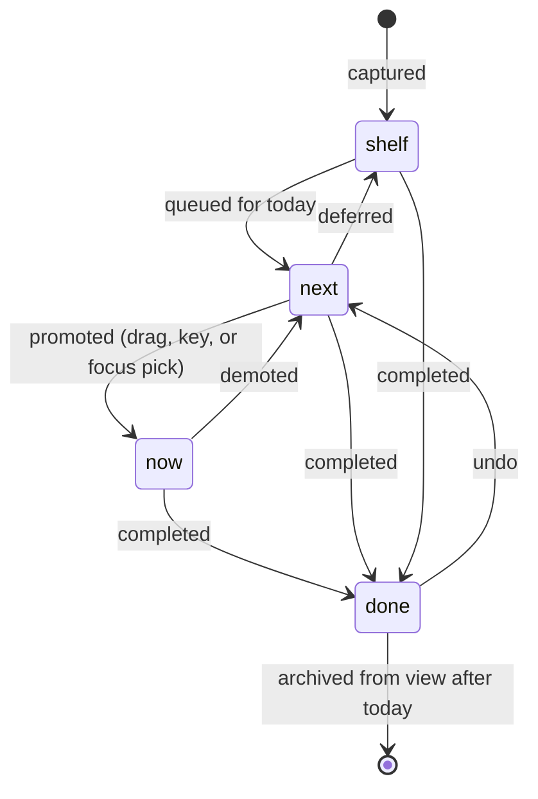
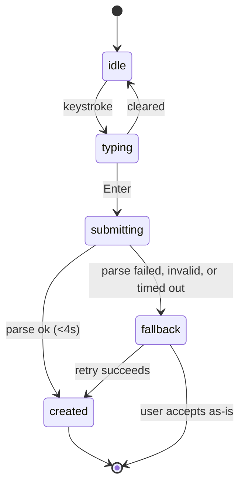
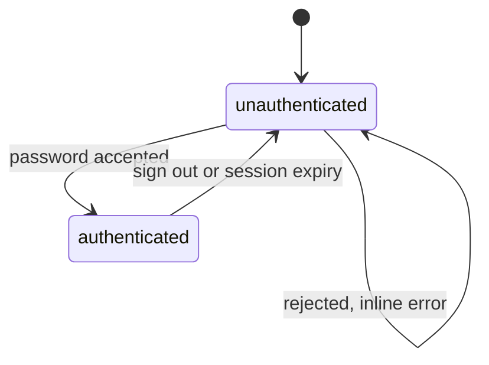
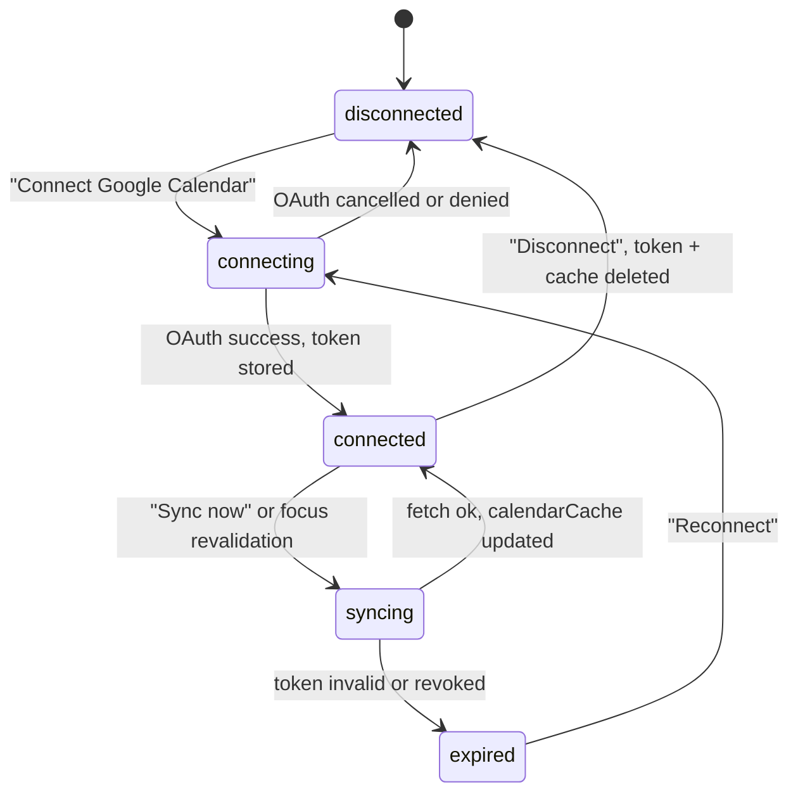

> **Project:** Ledger · **Doc:** App Flow · **Version:** 2.0 · **Date:** 2026-08-17
> **Status:** Draft
> **Upstream:** `01-prd.md`

# App flow

Seven surfaces. Only two are full screens; the rest are panels over the board,
because the board is where the user actually lives and pushing them off it is the
fastest way to break flow.

| # | Surface | Type | Reached from |
|---|---|---|---|
| S1 | Lock | Route `/login` | Any route while unauthenticated |
| S2 | Board | Route `/` | After auth. The default and only home |
| S3 | First run | State of S2 | S2 when no schedule blocks exist |
| S4 | Schedule editor | Slide-over panel | S2 rail, or the S3 prompt |
| S5 | Task detail | Inline card expansion | Clicking a card on S2 |
| S6 | Settings | Slide-over panel | S2 header |
| S7 | Calendar connect | Panel inside S6 | S6, or a prompt in Today's shape |

Panels, not modals. The board stays visible and interactive behind them — a modal
would be the lazy answer here and the product register bans it as a first thought.

## S2 — Board

The primary surface, four regions left to right:

- **Everything** (rail) — full backlog grouped by course, plus the 14-day Horizon.
- **Start here** — exactly one card, larger and differently shaped, with the AI's
  one-line reason and its position in a parent breakdown. Below it, Today's shape.
- **Then** — the ordered queue with the cutline drawn where the day runs out.
- **Done** — collapsed, struck through, filtered to today only.

Capture is fixed to the bottom, always reachable, never covered.

### Regions and their empty states

| Region | Empty state | Why it teaches |
|---|---|---|
| Everything | "Nothing on the shelf. Type a sentence below." | Points at the one gesture that matters |
| Start here | "Nothing queued. Add something, or pull a card from the shelf." | Names both ways in |
| Then | "Your day is clear." Neutral, not congratulatory | Overcommitment is the enemy; an empty queue is not a failure |
| Done | Hidden entirely until the first completion today | An empty Done lane is visual debt |
| Today's shape | Shown with committed blocks only, plus "No schedule yet — set one up" linking to S4. If schedule exists but Calendar isn't connected: a quiet, dismissible "Connect Google Calendar to see events here too" linking to S7 | Two different empty states for two different missing inputs — conflating them would hide which one actually matters right now |

## S3 — First run

Triggered when zero schedule blocks exist. Not a wizard and not a tour — the board
renders normally with two things changed: Today's shape shows a single prompt to
set the weekly schedule, and capture is pre-focused with an example placeholder.

Two steps, in this order, because capacity is meaningless without the first:

1. Set the weekly schedule (S4).
2. Capture the first task.

Connecting Calendar (S7) is offered but never required to exit first run — the
manual schedule alone produces a correct, if less complete, capacity figure.

**Exit:** dismissible. A user who skips the schedule gets a board with no capacity
figure and a persistent, quiet prompt in Today's shape — not a blocked app.

## S4 — Schedule editor

A week grid. Add, edit, delete recurring blocks: weekday, start, end, label, kind
(`class` / `work` / `commute` / `other`).

Blocks carry `activeFrom` / `activeTo` so a semester change does not destroy
history. The editor writes `activeFrom = today` on new blocks and sets `activeTo`
rather than deleting when a block ends.

**Exit:** close returns to S2 with free windows and capacity recomputed
immediately. No save button — changes commit per edit.

## S5 — Task detail

The card expands in place. Editable: title, course, estimate, due date (M14).
Actions: break down (M7), delete with undo (M15), move to lane.

**Exit:** click outside or Escape collapses it. No route change, no modal.

## S6 — Settings

Theme (light / dark / auto) · AI provider and model selection with a live key
check · Calendar connection status, linking to S7 · an `aiLog` review list
(recent parses, whether each needed correction) · export all data as JSON · sign
out.

These are the "fully built and available" config surfaces from the amendment —
real screens, not stubs deferred past v1.

## S7 — Calendar connect

Reached from S6 or from the Today's shape prompt. Shows one of three states:

- **Disconnected** — a single "Connect Google Calendar" button starting the
  OAuth flow (Google's consent screen, `calendar.readonly` scope only).
- **Connected** — last successful sync time, a **Sync now** button, a
  Disconnect button.
- **Sync failed / token expired** — the same panel with a plain-language reason
  ("Google says this connection expired — reconnect") and a reconnect button.
  This state also surfaces as the quiet Today's shape prompt from S2, so the
  user isn't required to open Settings to notice.

**Exit:** close returns to S6 or S2. Disconnecting deletes the stored refresh
token and the `calendarCache` rows; the schedule and board are unaffected.

## State machines

### Task lifecycle

Invariant: **at most one task in `now`**, enforced in the mutation. Promoting a
second demotes the first to `next` rather than rejecting the move — silently
failing a drag is worse than resolving it.

Every state has an exit. `done` is terminal for the day and reversible via undo.

### Capture

`typing` runs the **heuristic** parser locally for the live preview — no network,
no quota, no latency. The model is called only on submit, via a Server Action.
This means the preview is always instant and the AI is never speculative.

`submitting` has a hard 4s ceiling. There is no path from `submitting` back to
`idle`: the card is created either way.

### Session

### Calendar connection

`syncing` never blocks the board — it runs against the cache, and capacity always
has a value from the manual schedule regardless of where this machine is.

## Cross-cutting states

| State | Where it shows | Behaviour |
|---|---|---|
| AI unavailable (no key, quota, network) | Quiet indicator in S6; a `fallback` badge on affected cards | Board fully functional. Never blocks, never modal |
| Calendar sync stale or failed | Quiet prompt in Today's shape (S2); detailed state in S7 | Capacity silently falls back to the manual schedule. Never a blocking error |
| Offline | Small persistent marker near capture | Captures queue in `localStorage`, flush on reconnect. Board stays readable and draggable |
| Parse fallback | Badge on the card, with retry | One tap re-runs the model on that card |
| Over capacity | Header figure in alert, cutline in the queue, red blocks in Today's shape | Three coordinated signals, no dialog, no nag |
| Deleting | Toast with undo, ~6s | No confirmation dialog |
